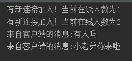

#1.注意事项
端口可以自己指定，注意static/index.html中的通信地址一致就行   
websocket = new WebSocket("ws://localhost:8084/websocket");   

#2.思路
http://note.youdao.com/noteshare?id=a1f84e2d089a7219a25a6310f5637d99&sub=9AC9708A12364E23A70BDBF83E7DD3D7

#3.运行项目
运行WebSocketApplication.main()就行。   
在浏览器中输入localhost:8084/index.html(每打开一个这个页面就会有一个连接建立，控制台中能看到)   
多打开几个页面或者打开不同的浏览器（如果你不嫌麻烦且你电脑上有那么多浏览器）试试看吧
 
 
 
 